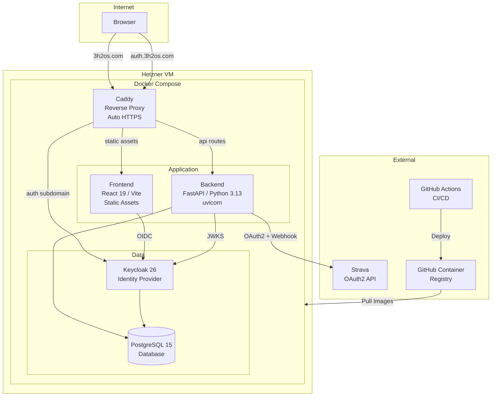
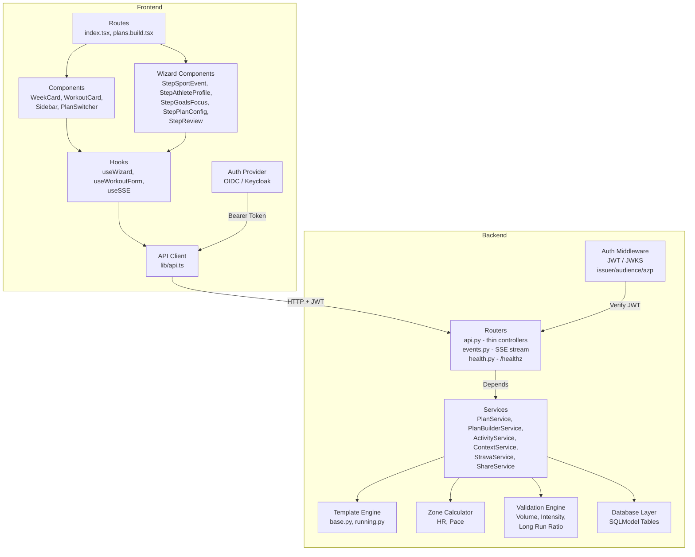
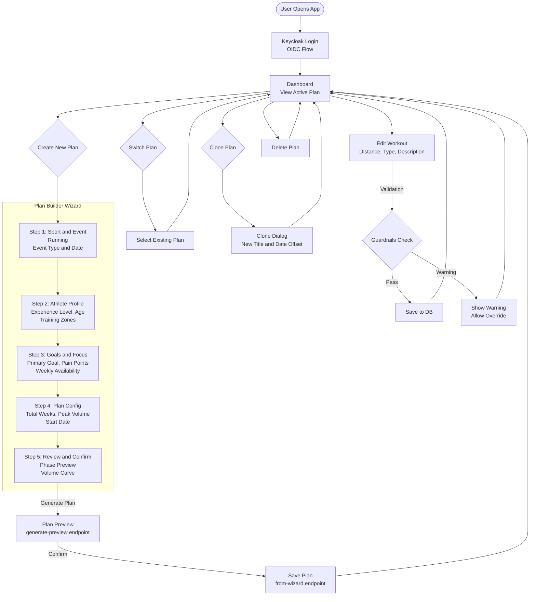

# 3h2Os

A training plan platform for running. Create periodised training plans via a guided wizard, track progress against targets, and sync with Strava.

**Production**: [3h2os.com](https://3h2os.com)

## Features

- **Plan Builder Wizard** -- guided multi-step flow to create periodised training plans for running (5K to Ultra) using template, manual, or manual-weekly generation
- **Template Engine** -- 15 running plan templates across beginner/intermediate/advanced levels with auto-calculated training zones
- **Multi-Plan Support** -- manage multiple concurrent plans (e.g. a 5K plan and a marathon plan) with plan switching
- **Workout Management** -- full CRUD for workouts with validation guardrails (volume progression, intensity ratio, long run cap). Plan writes are atomic (single transaction per create/replace/activate/progression).
- **Strava Integration** -- OAuth connect (single-use, user-bound state), activity sync with zone distribution, webhook-driven auto-sync with durable idempotent jobs, and real-time SSE push to connected browsers. Historical Garmin activity rows are preserved as read-only records; no Garmin write paths exist.
- **Clone Plans** -- duplicate an existing plan with date offsets for reuse
- **Authentication** -- Keycloak OIDC with JWT (RS256) for multi-user support. Issuer, audience, and authorized party (`azp`) claims are enforced. Users are resolved by `(oidc_issuer, oidc_subject)`; username/email are mutable profile attributes.
- **Health Probe** -- `GET /healthz` (unauthenticated) for container healthchecks and external smoke tests.

## Tech Stack

| Layer | Technology |
|-------|-----------|
| Backend | Python 3.13, FastAPI, SQLModel |
| Frontend | React 19, TypeScript, TanStack Router/Query, Tailwind CSS |
| Database | PostgreSQL 15 (Alembic migrations) |
| Auth | Keycloak 26 (OIDC/JWT) |
| Infrastructure | Docker Compose, Caddy (reverse proxy + auto HTTPS), Hetzner Cloud |
| CI/CD | GitHub Actions, GHCR |
| Package Managers | uv (Python), npm (Frontend) |

## Project Structure

```
3h2Os/
  backend/
    app/
      routers/          # FastAPI endpoints (thin controllers)
      services/         # Business logic (PlanService, PlanBuilderService, StravaService, etc.)
      core/
        database.py     # SQLModel tables (User, RunnerPlan, PlanWeek, PlanWorkout, etc.)
        templates/      # Plan template engine (running.py, base.py)
        validation.py   # Training guardrails (volume cap, intensity ratio, long run ratio)
        zones.py        # Zone calculator (HR, pace)
        auth.py         # JWT/Keycloak auth middleware (issuer/audience/azp enforced)
      models/           # Domain dataclasses and enums
      schemas.py        # Pydantic DTOs
    scripts/            # Automation (validation, plan updates)
    db/migrations/      # Forward-only SQL migrations
    tests/              # pytest test suite
  frontend/
    src/
      routes/           # TanStack file-based routes
      components/       # UI components (WeekCard, WorkoutCard, Sidebar, etc.)
        wizard/         # Plan builder wizard (6 step components)
      hooks/            # Custom hooks (useWizard, useWorkoutForm, useSSE)
      lib/              # API client, auth, dateTime, formatters, calculations
      types/            # TypeScript type definitions
      providers/        # Auth context provider
  docker-compose.yml    # Dev stack (backend, frontend, postgres, keycloak)
  docker-compose.prod.yml  # Production stack (+ caddy)
  Caddyfile             # Reverse proxy config (3h2os.com, auth.3h2os.com)
  .ai/                  # AI assistant context and skills
  .github/workflows/    # CI/CD (deploy.yml, test.yml)
```

## Getting Started

### Prerequisites

- [uv](https://docs.astral.sh/uv/) (Python package manager)
- Node.js LTS (run `nvml` on host before npm commands)
- Docker Desktop (for full stack)

### Quick Start (Docker)

```bash
docker compose up --build
```

- **Frontend**: http://localhost:5173
- **Backend API**: http://localhost:8000 (Docs: http://localhost:8000/docs)
- **Keycloak**: http://localhost:8080
- **Database**: PostgreSQL (internal, port 5432)

### Local Development

```bash
# Backend
cd backend
uv sync
uv run python -m db.migrate
uv run uvicorn app.main:app --reload

# Frontend (separate terminal)
cd frontend
npm install
npm run dev
```

### Running Tests

```bash
# Backend
cd backend
uv run pytest

# Frontend
cd frontend
npm test
```

## API Endpoints

| Method | Path | Purpose |
|--------|------|---------|
| `GET` | `/healthz` | Unauthenticated health probe for container healthchecks and smoke tests |
| `GET` | `/api/plans` | List all plans for the current user |
| `POST` | `/api/plans` | Create a new empty plan |
| `DELETE` | `/api/plans/{id}` | Delete a plan |
| `PUT` | `/api/plans/{id}/activate` | Set a plan as active |
| `GET` | `/api/plan.json` | Get active plan (list of weeks) |
| `POST` | `/api/plan.json` | Replace the active plan |
| `GET` | `/api/actuals.json` | Get actual activities for the active plan |
| `POST` | `/api/actuals` | Bulk save actual activities |
| `GET` | `/api/context.json` | Get user context (profile, project, zones) |
| `PUT` | `/api/weeks/{id}` | Update a week (status, etc.) |
| `POST` | `/api/workouts` | Create a workout |
| `PUT` | `/api/workouts/{id}` | Update a workout |
| `DELETE` | `/api/workouts/{id}` | Delete a workout |
| `POST` | `/api/plans/generate-preview` | Preview a plan from wizard inputs (no save) |
| `POST` | `/api/plans/from-wizard` | Generate and save a plan from wizard inputs (`generation_method` accepts `template`, `manual`, `manual_weekly`; `ai` is rejected with 422) |
| `POST` | `/api/plans/{id}/clone` | Clone an existing plan |
| `GET` | `/api/strava/auth-url` | Get Strava OAuth authorization URL |
| `POST` | `/api/strava/exchange` | Exchange Strava auth code for tokens (single-use state) |
| `GET` | `/api/strava/status` | Check Strava connection status |
| `DELETE` | `/api/strava/disconnect` | Disconnect Strava |
| `POST` | `/api/integrations/strava/sync` | Manual sync from Strava |
| `GET/POST` | `/strava/webhook/{secret}` | Strava webhook (verify + event receiver; events persisted as jobs and processed by a background worker) |
| `GET` | `/api/events` | SSE stream — real-time push events for the current user |

## Validation Engine

The training guardrails enforce safe progression on every workout save/update:

- **Volume Progression**: weekly volume increase capped at 15%
- **Long Run Ratio**: single long run must not exceed 40% of weekly volume
- **Intensity Ratio**: high intensity work must not exceed 25% of weekly volume

## Time Model

The platform distinguishes instants from calendar dates to avoid timezone bugs:

- **Instants** are timezone-aware UTC (`TIMESTAMPTZ`), serialized as RFC 3339 with a `Z` or `+00:00` suffix. Examples: plan creation timestamps, Strava token timestamps, profile sync timestamps, activity share creation, migration application, exact activity start (`actualactivity.started_at`).
- **Calendar dates** are timezone-neutral `DATE` values (`YYYY-MM-DD`). Examples: workout date, week start date, event date, birthday, provider-local activity date.
- **User timezone**: each user has an IANA timezone on `RunnerProfile.timezone_name`. Backend calendar business rules (current workout/week, past restrictions, next-Monday scheduling, race-day placement) use the user's timezone, not the container's. Falls back to UTC when absent or invalid.
- **Strava activities**: `started_at` (UTC instant from `start_date`) is stored separately from `date` (provider-local calendar date from `start_date_local`). Plan completion is matched by `date`.
- **Browser display**: `frontend/src/lib/dateTime.ts` formats instants in the browser's timezone and locale (`formatInstant`) and formats calendar dates timezone-invariantly (`formatCalendarDate`). The browser IANA timezone is synced to `RunnerProfile.timezone_name`.

## Environment Configuration

All configuration lives in a single `.env` file at the repo root. Use `.env.example` as the template.

### Local development

```bash
cp .env.example .env
# Fill in values — the Strava and database vars are the minimum needed
```

Key vars for local dev:

| Variable | Purpose |
|----------|---------|
| `DATABASE_URL` | PostgreSQL connection string |
| `STRAVA_CLIENT_ID` / `STRAVA_CLIENT_SECRET` | Strava OAuth app credentials |
| `STRAVA_REDIRECT_URI` | `http://localhost:5173/strava/callback` |
| `STRAVA_STATE_SECRET` | Long random string — `openssl rand -hex 32` |
| `KEYCLOAK_ADMIN_USER` / `KEYCLOAK_ADMIN_PASSWORD` | Keycloak admin credentials |

### Production (deployed via `act`)

Production deployment uses [act](https://github.com/nektos/act) to run the GitHub Actions workflow locally against the production server. The workflow assembles the prod `.env` from GitHub Environment secrets/variables and copies it to the server via SCP.

`.actrc` at the repo root configures `act` automatically — no extra flags needed:

```
-a michaelbramwell
--secret-file .secrets
--var-file .vars
--env DOCKER_CONFIG=.docker
```

A `.secrets` file supplies secrets (mirrors GitHub Environment secrets):

```bash
cp .secrets.example .secrets
# Fill in real values
```

A `.vars` file supplies non-secret variables (mirrors GitHub Environment variables):

```bash
cp .vars.example .vars
# Fill in real values
```

Key `.secrets` entries:

| Key | Purpose |
|-----|---------|
| `DEPLOY_HOST` / `DEPLOY_USER` / `DEPLOY_KEY` | SSH access to production server |
| `POSTGRES_PASSWORD` | Production DB password |
| `STRAVA_CLIENT_SECRET` | Prod Strava app secret |
| `STRAVA_STATE_SECRET` | Long random string (prod) |
| `STRAVA_WEBHOOK_SECRET` | Secret path segment for webhook URL |
| `STRAVA_WEBHOOK_VERIFY_TOKEN` | Token used during Strava webhook registration |
| `GITHUB_TOKEN` | For pulling images from GHCR |

Key `.vars` entries:

| Variable | Value |
|----------|-------|
| `STRAVA_CLIENT_ID` | Prod Strava app client ID |
| `STRAVA_REDIRECT_URI` | `https://3h2os.com/strava/callback` |
| `DOMAIN` | `3h2os.com` |
| `POSTGRES_USER` / `POSTGRES_DB` | Production DB credentials |

Run deployment:

```bash
act -j deploy
```

### Strava webhook registration (one-time, after first deploy)

Once the server is running with `STRAVA_WEBHOOK_SECRET` and `STRAVA_WEBHOOK_VERIFY_TOKEN` set, register the webhook subscription with Strava:

```bash
curl -X POST https://www.strava.com/api/v3/push_subscriptions \
  -F client_id=<STRAVA_CLIENT_ID> \
  -F client_secret=<STRAVA_CLIENT_SECRET> \
  -F callback_url=https://3h2os.com/strava/webhook/<STRAVA_WEBHOOK_SECRET> \
  -F verify_token=<STRAVA_WEBHOOK_VERIFY_TOKEN>
```

Verify the endpoint is reachable before registering:

```bash
curl "https://3h2os.com/strava/webhook/<STRAVA_WEBHOOK_SECRET>?hub.mode=subscribe&hub.challenge=test&hub.verify_token=<STRAVA_WEBHOOK_VERIFY_TOKEN>"
# Expected: {"hub.challenge": "test"}
```

## Deployment

Production runs on Hetzner Cloud with the following architecture:

- **Caddy** handles TLS termination (Let's Encrypt) and reverse proxying
- **3h2os.com** routes to the frontend container (static assets) and `/api` to the backend
- **auth.3h2os.com** routes to Keycloak
- **GitHub Actions** builds Docker images, pushes to GHCR, and deploys via SSH
- **Test-gated**: the deploy workflow runs the backend and frontend test suites before building images. A failing test blocks the deploy.
- **Immutable images**: production images are tagged with the commit SHA; `:latest` is never used in prod.
- **Health-checked**: the deploy waits for `GET /healthz` to return 200 on the new container before switching traffic.
- **Rollback on smoke-test failure**: if the post-deploy smoke test fails, the workflow rolls back to the previous image.

## Architecture Diagrams

### Systems Architecture



### Code Architecture



### User Flow



## License

This project is licensed under the [Business Source License 1.1](LICENSE).

- **Additional Use Grant**: Non-competing SaaS (you may not use the software to provide a commercial Training Plan Service)
- **Change Date**: 2030-02-12
- **Change License**: AGPL 3.0
