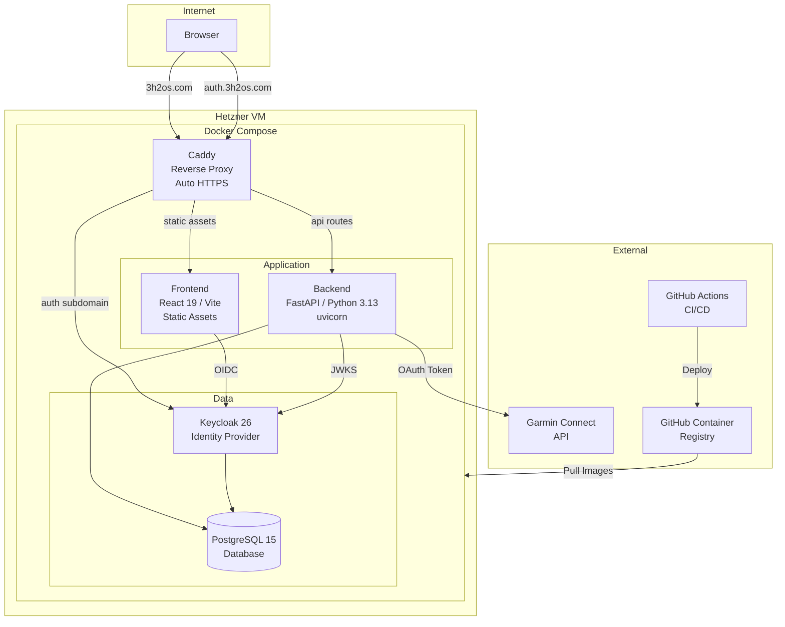
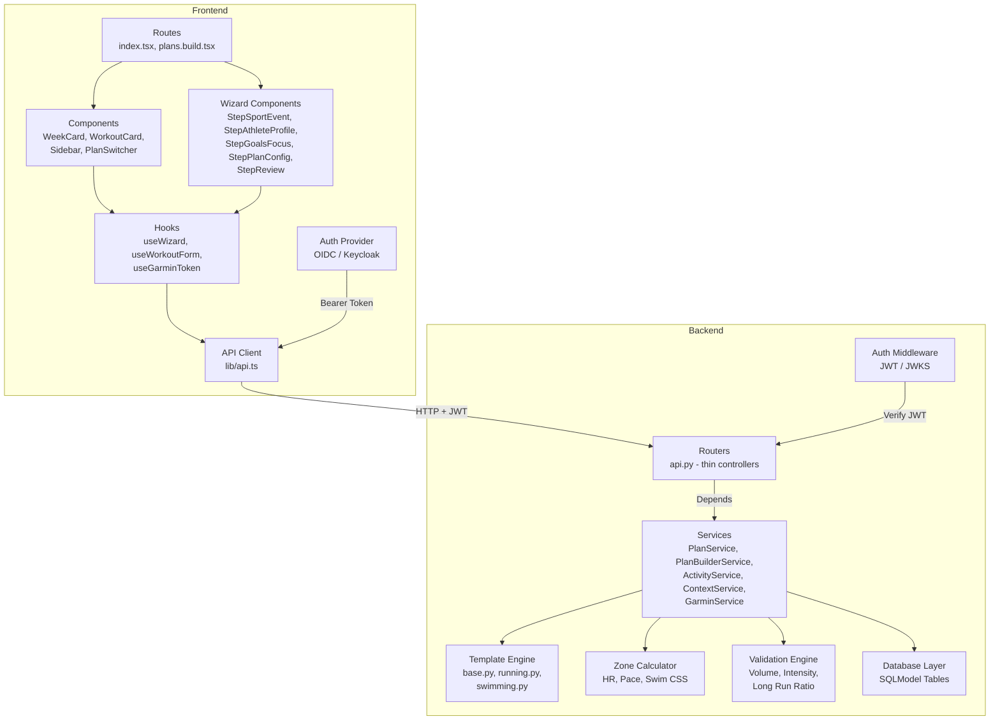
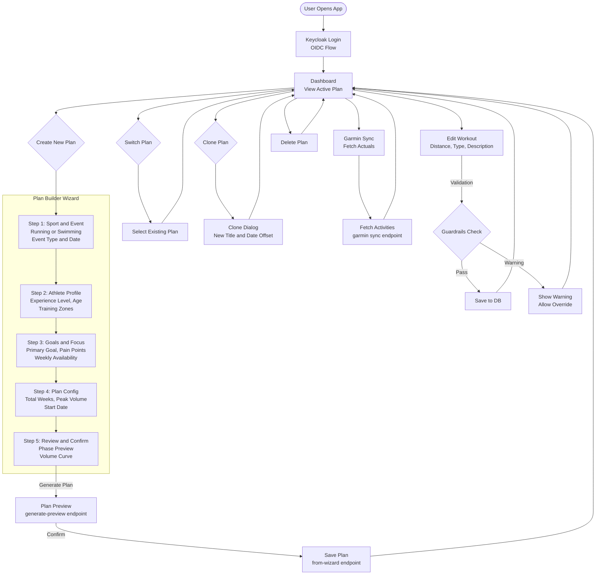

# 3h2Os

A multi-sport training plan platform for running and swimming. Create periodised training plans via a guided wizard, track progress against targets, and sync with Garmin Connect.

**Production**: [3h2os.com](https://3h2os.com)

## Features

- **Plan Builder Wizard** -- guided multi-step flow to create periodised training plans for running (5K to Ultra) and swimming (pool and open water events)
- **Template Engine** -- 39 plan templates (15 running + 24 swimming) across beginner/intermediate/advanced levels with auto-calculated training zones
- **Multi-Plan Support** -- manage multiple concurrent plans (e.g. a marathon plan and a swim plan) with plan switching
- **Workout Management** -- full CRUD for workouts with validation guardrails (volume progression, intensity ratio, long run cap)
- **Garmin Connect Integration** -- sync actual activities from Garmin, with zone distribution and telemetry enrichment
- **Clone Plans** -- duplicate an existing plan with date offsets for reuse
- **Authentication** -- Keycloak OIDC with JWT (RS256) for multi-user support

## Tech Stack

| Layer | Technology |
|-------|-----------|
| Backend | Python 3.13, FastAPI, SQLModel |
| Frontend | React 19, TypeScript, TanStack Router/Query, Tailwind CSS |
| Database | PostgreSQL 15 (Alembic migrations) |
| Auth | Keycloak 26 (OIDC/JWT) |
| Infrastructure | Docker Compose, Caddy (reverse proxy + auto HTTPS), Hetzner Cloud |
| CI/CD | GitHub Actions, GHCR |
| Package Managers | uv (Python), npm (Frontend) |

## Project Structure

```
3h2Os/
  backend/
    app/
      routers/          # FastAPI endpoints (thin controllers)
      services/         # Business logic (PlanService, PlanBuilderService, GarminService, etc.)
      core/
        database.py     # SQLModel tables (User, RunnerPlan, PlanWeek, PlanWorkout, etc.)
        templates/      # Plan template engine (running.py, swimming.py, base.py)
        validation.py   # Training guardrails (volume cap, intensity ratio, long run ratio)
        zones.py        # Zone calculator (HR, pace, swim CSS)
        auth.py         # JWT/Keycloak auth middleware
      models/           # Domain dataclasses and enums
      schemas.py        # Pydantic DTOs
    scripts/            # Automation (Garmin sync, validation, plan updates)
    migrations/         # Alembic database migrations
    tests/              # pytest test suite
  frontend/
    src/
      routes/           # TanStack file-based routes
      components/       # UI components (WeekCard, WorkoutCard, Sidebar, etc.)
        wizard/         # Plan builder wizard (6 step components)
      hooks/            # Custom hooks (useWizard, useWorkoutForm, useGarminToken)
      lib/              # API client, auth, formatters, calculations
      types/            # TypeScript type definitions
      providers/        # Auth context provider
  docker-compose.yml    # Dev stack (backend, frontend, postgres, keycloak)
  docker-compose.prod.yml  # Production stack (+ caddy)
  Caddyfile             # Reverse proxy config (3h2os.com, auth.3h2os.com)
  .ai/                  # AI assistant context and skills
  .github/workflows/    # CI/CD (deploy.yml, test.yml)
```

## Getting Started

### Prerequisites

- [uv](https://docs.astral.sh/uv/) (Python package manager)
- Node.js LTS (run `nvml` on host before npm commands)
- Docker Desktop (for full stack)

### Quick Start (Docker)

```bash
docker compose up --build
```

- **Frontend**: http://localhost:5173
- **Backend API**: http://localhost:8000 (Docs: http://localhost:8000/docs)
- **Keycloak**: http://localhost:8080
- **Database**: PostgreSQL (internal, port 5432)

### Local Development

```bash
# Backend
cd backend
uv sync
uv run alembic upgrade head
uv run uvicorn app.main:app --reload

# Frontend (separate terminal)
cd frontend
npm install
npm run dev
```

### Running Tests

```bash
# Backend
cd backend
uv run pytest

# Frontend
cd frontend
npm test
```

## API Endpoints

| Method | Path | Purpose |
|--------|------|---------|
| `GET` | `/api/plans` | List all plans for the current user |
| `POST` | `/api/plans` | Create a new empty plan |
| `DELETE` | `/api/plans/{id}` | Delete a plan |
| `PUT` | `/api/plans/{id}/activate` | Set a plan as active |
| `GET` | `/api/plan.json` | Get active plan (list of weeks) |
| `POST` | `/api/plan.json` | Replace the active plan |
| `GET` | `/api/actuals.json` | Get actual activities for the active plan |
| `POST` | `/api/actuals` | Bulk save actual activities |
| `GET` | `/api/context.json` | Get user context (profile, project, zones) |
| `PUT` | `/api/weeks/{id}` | Update a week (status, etc.) |
| `POST` | `/api/workouts` | Create a workout |
| `PUT` | `/api/workouts/{id}` | Update a workout |
| `DELETE` | `/api/workouts/{id}` | Delete a workout |
| `POST` | `/api/plans/generate-preview` | Preview a plan from wizard inputs (no save) |
| `POST` | `/api/plans/from-wizard` | Generate and save a plan from wizard inputs |
| `POST` | `/api/plans/{id}/clone` | Clone an existing plan |
| `POST` | `/api/garmin/token` | Authenticate with Garmin (returns OAuth token) |
| `POST` | `/api/integrations/garmin/sync` | Sync activities from Garmin Connect |

## Validation Engine

The training guardrails enforce safe progression on every workout save/update:

- **Volume Progression**: weekly volume increase capped at 15%
- **Long Run Ratio**: single long run must not exceed 40% of weekly volume
- **Intensity Ratio**: high intensity work must not exceed 25% of weekly volume

## Deployment

Production runs on Hetzner Cloud with the following architecture:

- **Caddy** handles TLS termination (Let's Encrypt) and reverse proxying
- **3h2os.com** routes to the frontend container (static assets) and `/api` to the backend
- **auth.3h2os.com** routes to Keycloak
- **GitHub Actions** builds Docker images, pushes to GHCR, and deploys via SSH

## Architecture Diagrams

### Systems Architecture



### Code Architecture



### User Flow



## License

This project is licensed under the [Business Source License 1.1](LICENSE).

- **Additional Use Grant**: Non-competing SaaS (you may not use the software to provide a commercial Training Plan Service)
- **Change Date**: 2030-02-12
- **Change License**: AGPL 3.0
